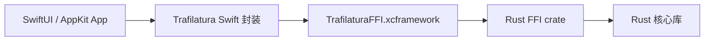

# Swift / macOS 集成指南

本文说明如何将 `trafilatura-rust-for-mcp` 作为 Swift Package 用在 SwiftUI 或 AppKit macOS 原生客户端中。

## 架构



Swift App 不直接调用 Rust crate，而是通过：

1. Rust FFI crate 导出的 C ABI。
2. `TrafilaturaFFI.xcframework` 二进制包装。
3. Swift Package 中的 `Trafilatura` Swift 封装层。

## 目录结构

```text
crates/trafilatura-ffi/
├── Cargo.toml
├── include/
│   ├── trafilatura_ffi.h
│   └── module.modulemap
└── src/lib.rs

swift/TrafilaturaSwift/
├── Package.swift
├── Frameworks/
│   └── TrafilaturaFFI.xcframework
└── Sources/
    └── Trafilatura/
        └── Trafilatura.swift
```

## 构建 Swift Package 二进制依赖

在项目根目录运行：

```bash
scripts/build-swift-package.sh
```

该脚本会：

1. 添加 Rust macOS targets：
   - `aarch64-apple-darwin`
   - `x86_64-apple-darwin`
2. 编译 `trafilatura-ffi` 静态库。
3. 使用 `lipo` 合并 Apple Silicon 与 Intel 静态库。
4. 使用 `xcodebuild -create-xcframework` 生成：

```text
swift/TrafilaturaSwift/Frameworks/TrafilaturaFFI.xcframework
```

## 在 Xcode 中引用

1. 打开 SwiftUI/AppKit macOS 项目。
2. 选择 `File → Add Package Dependencies...`。
3. 选择本地路径：

```text
/Users/yakii/code/Self-Test/trafilatura-rust-for-mcp/swift/TrafilaturaSwift
```

4. 添加 product：

```text
Trafilatura
```

之后 Swift 代码中可以：

```swift
import Trafilatura
```

## Swift API

```swift
let text = try Trafilatura.extractText(fromHTML: html)
let json = try Trafilatura.extractJSONForMCP(fromHTML: html)
let custom = try Trafilatura.extract(
    fromHTML: html,
    optionsJSON: """
    {
      "format": "markdown",
      "include_links": true,
      "include_comments": false,
      "deduplicate": true
    }
    """
)
```

## SwiftUI 示例

```swift
import SwiftUI
import Trafilatura

struct ContentView: View {
    @State private var html = """
    <html>
      <body>
        <article>
          <h1>Hello</h1>
          <p>This is a test article.</p>
        </article>
      </body>
    </html>
    """

    @State private var output = ""

    var body: some View {
        VStack(spacing: 12) {
            TextEditor(text: $html)
                .font(.system(.body, design: .monospaced))
                .frame(height: 220)

            HStack {
                Button("提取正文") {
                    Task.detached {
                        let result = Result {
                            try Trafilatura.extractText(fromHTML: html)
                        }

                        await MainActor.run {
                            switch result {
                            case .success(let text):
                                output = text
                            case .failure(let error):
                                output = "提取失败：\(error.localizedDescription)"
                            }
                        }
                    }
                }

                Button("提取 MCP JSON") {
                    Task.detached {
                        let result = Result {
                            try Trafilatura.extractJSONForMCP(fromHTML: html)
                        }

                        await MainActor.run {
                            switch result {
                            case .success(let json):
                                output = json
                            case .failure(let error):
                                output = "提取失败：\(error.localizedDescription)"
                            }
                        }
                    }
                }
            }

            TextEditor(text: $output)
                .font(.system(.body, design: .monospaced))
                .frame(height: 260)
        }
        .padding()
    }
}
```

## 线程建议

正文提取是同步 CPU 工作。对于较大的 HTML，不建议在主线程直接调用。SwiftUI 中推荐使用：

```swift
Task.detached {
    let result = Result {
        try Trafilatura.extractText(fromHTML: html)
    }

    await MainActor.run {
        // 更新 UI
    }
}
```

## 内存安全

Rust FFI 层返回的字符串由 Rust 分配。Swift 封装层会自动调用：

```c
trafilatura_free_result(result)
```

因此业务代码不需要直接处理 C 指针，也不需要手动释放内存。

## 自定义选项 JSON

`extract(fromHTML:optionsJSON:)` 支持以下字段：

```json
{
  "format": "markdown",
  "url": "https://example.com/article",
  "include_links": true,
  "include_comments": false,
  "include_formatting": true,
  "include_tables": true,
  "include_images": false,
  "deduplicate": true,
  "with_metadata": true
}
```

`format` 可选值：

- `text` / `txt`
- `markdown` / `md`
- `json`
- `xml`
- `html`

## 常见问题

### 找不到 `TrafilaturaFFI.xcframework`

先运行：

```bash
scripts/build-swift-package.sh
```

### `xcodebuild` 不存在

需要安装 Xcode 或 Command Line Tools。

### Intel target 编译失败

确认已安装目标：

```bash
rustup target add x86_64-apple-darwin
```

### SwiftUI 界面卡顿

不要在主线程处理大 HTML。使用 `Task.detached` 或后台队列。
