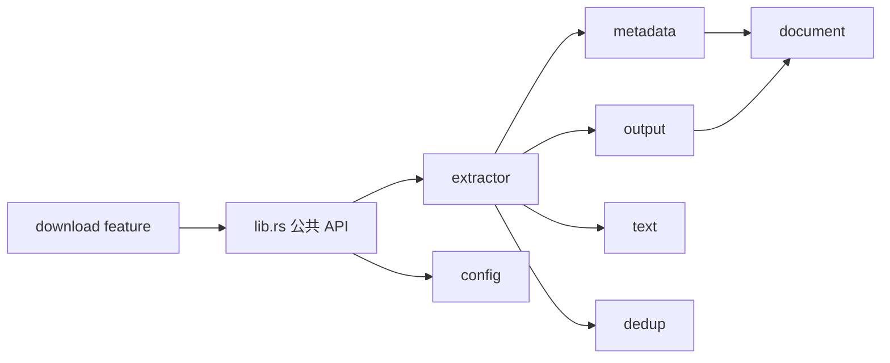
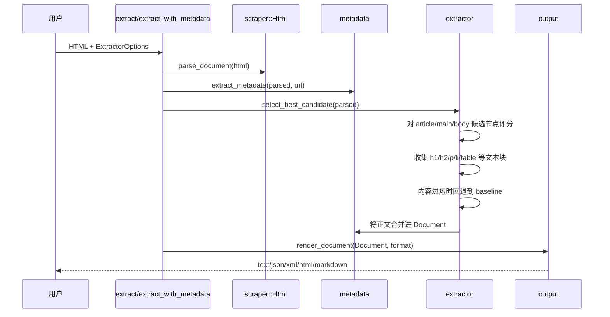

# 技术架构

## 设计目标

`trafilatura-rust-for-mcp` 是一个 Rust 公共库，用于从网页中提取有用的正文文本和元数据。

Python Trafilatura 项目使用 `lxml` 和大量 XPath 启发式规则。Rust 生态不同，因此这个移植版本没有直接翻译 XPath，而是使用 `scraper`/`html5ever`、CSS 选择器以及自定义评分函数来实现相近目标。

## 模块关系



## 提取流程



## 核心数据结构

### `ExtractorOptions`

控制提取行为：

- `output_format`
- `focus`
- `url`
- `with_metadata`
- `include_comments`
- `include_formatting`
- `include_links`
- `include_tables`
- `include_images`
- `deduplicate`
- 大小阈值

### `Document`

可序列化的数据模型，包含：

- 标题、作者、URL、主机名
- 描述、站点名、日期
- 分类、标签
- 内容指纹
- 提取出的正文与评论
- 图片、页面类型、语言

## 候选内容选择

提取器会按优先级扫描可能的正文容器：

1. `article`
2. `main`
3. `itemprop*=articleBody`
4. 包含 article/post/story/body/content 等 class 或 ID 标记的节点
5. `[role=main]`
6. `body` 回退方案

每个候选节点会根据以下因素评分：

- 总文本长度
- 段落数量
- 标题数量
- 链接密度惩罚
- 当表格被禁用时的表格惩罚
- precision/recall 模式加成

## 样板内容过滤

如果节点的标签或属性表明它属于重复出现的非正文 UI，提取器会跳过该节点，例如：

- nav
- footer
- aside/sidebar
- forms
- breadcrumbs
- related content
- share/social widgets
- cookie banners
- ads/promos/widgets
- modals/overlays

## 元数据提取

`metadata` 模块会提取：

- OpenGraph 字段（`og:title`、`og:description`、`og:url` 等）
- 常见 meta name（`author`、`description`、`keywords` 等）
- canonical URL
- `title`/`h1` 回退标题
- JSON-LD 文章字段（`headline`、`author`、`publisher`、`datePublished` 等）

## 输出格式

`output` 模块可以将 `Document` 渲染为：

- TXT / Markdown，并可选择附加 YAML 风格的元数据头
- 通过 `serde_json` 输出 JSON
- 简单 XML
- 简单 HTML

## 错误处理

库 API 返回：

```rust
pub type Result<T> = std::result::Result<T, TrafilaturaError>;
```

错误被建模为值，并使用 `thiserror`。库代码避免使用 `unwrap()`。

## Feature flags

| Feature | 默认启用 | 用途 |
|---|---:|---|
| `download` | 是 | 启用异步 `reqwest` 下载器 |

## 与 Python Trafilatura 的差异

这个初始 Rust 移植版目前**尚未**实现：

- 完整 XPath 等价能力
- jusText 集成
- readability-lxml 等价能力
- TEI 校验
- feed/sitemap 爬取
- 高级语言检测
- 完整日期提取启发式规则

这些能力属于后续里程碑。
