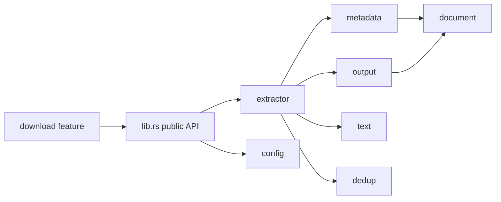
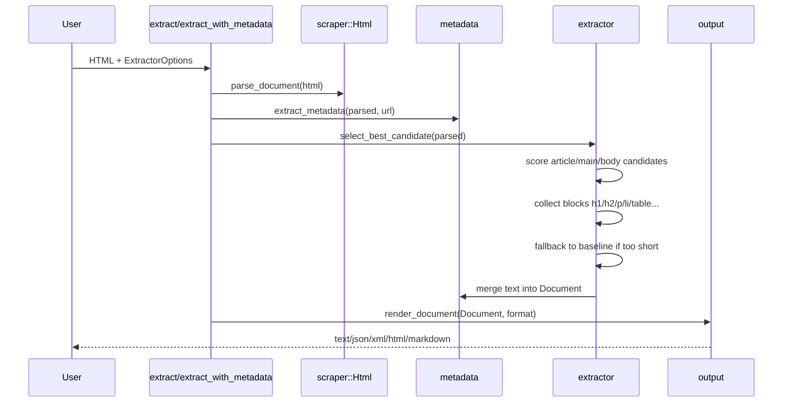

# Technical Architecture

## Design goals

`trafilatura-rust-for-mcp` is a Rust public library for extracting useful text and metadata from web pages.

The Python Trafilatura project uses `lxml` and extensive XPath heuristics. Rust has a different ecosystem, so this port uses `scraper`/`html5ever` with CSS selectors and custom scoring functions instead of a direct XPath translation.

## Module map



## Extraction pipeline



## Core data structures

### `ExtractorOptions`

Controls extraction behavior:

- `output_format`
- `focus`
- `url`
- `with_metadata`
- `include_comments`
- `include_formatting`
- `include_links`
- `include_tables`
- `include_images`
- `deduplicate`
- size thresholds

### `Document`

Serializable model containing:

- title, author, URL, hostname
- description, sitename, date
- categories, tags
- fingerprint
- extracted text and comments
- image, page type, language

## Candidate selection

The extractor scans likely content containers in priority order:

1. `article`
2. `main`
3. `itemprop*=articleBody`
4. article/post/story/body/content class and ID markers
5. `[role=main]`
6. `body` fallback

Each candidate is scored by:

- total text length
- number of paragraphs
- number of headings
- link density penalty
- table penalty if tables are disabled
- precision/recall focus bonus

## Boilerplate filtering

The extractor skips nodes whose tag or attributes indicate recurring non-content UI:

- nav
- footer
- aside/sidebar
- forms
- breadcrumbs
- related content
- share/social widgets
- cookie banners
- ads/promos/widgets
- modals/overlays

## Metadata extraction

The `metadata` module extracts:

- OpenGraph fields (`og:title`, `og:description`, `og:url`, etc.)
- common meta names (`author`, `description`, `keywords`, etc.)
- canonical URL
- `title`/`h1` fallback
- JSON-LD article fields (`headline`, `author`, `publisher`, `datePublished`, etc.)

## Output formats

The output module renders `Document` as:

- TXT / Markdown with optional YAML-style metadata header
- JSON via `serde_json`
- simple XML
- simple HTML

## Error handling

Library APIs return:

```rust
pub type Result<T> = std::result::Result<T, TrafilaturaError>;
```

Errors are values and use `thiserror`. Library code avoids `unwrap()`.

## Feature flags

| Feature | Default | Purpose |
|---|---:|---|
| `download` | yes | Enables async `reqwest` downloader |

## Differences from Python Trafilatura

This initial Rust port intentionally does **not** yet implement:

- full XPath parity
- jusText integration
- readability-lxml parity
- TEI validation
- feed/sitemap crawling
- advanced language detection
- complete date extraction heuristics

These are future milestones.
